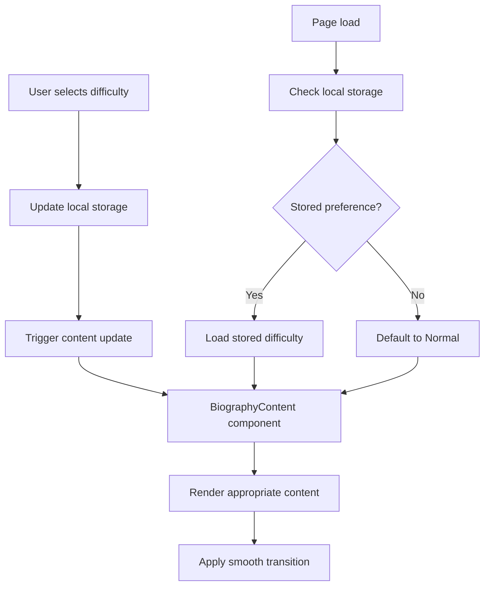

# Design Document

## Overview

The biography difficulty selector will transform the current single-biography experience into an interactive, multi-level content system. Users will be able to choose from five difficulty levels, each providing progressively more detailed biographical information. The system will integrate seamlessly with the existing Astro-based architecture while maintaining the site's aesthetic and performance characteristics.

## Architecture

### Component Structure

The system will consist of three main components:

1. **BiographyDifficultySelector**: A new interactive component that renders the difficulty selection interface
2. **BiographyContent**: A new component that manages and displays content based on selected difficulty
3. **Enhanced Bio Component**: The existing Bio.astro component will be updated to integrate the new functionality

### Data Flow



## Components and Interfaces

### BiographyDifficultySelector Component

**Location**: `src/components/BiographyDifficultySelector.astro`

**Props Interface**:
```typescript
interface DifficultyLevel {
  id: string;
  name: string;
  description: string;
}

interface Props {
  levels: DifficultyLevel[];
  defaultLevel?: string;
  onLevelChange?: (level: string) => void;
}
```

**Functionality**:
- Renders five difficulty buttons with distinct visual styling
- Manages active state and hover effects
- Handles click events and local storage updates
- Provides tooltips with difficulty descriptions

### BiographyContent Component

**Location**: `src/components/BiographyContent.astro`

**Props Interface**:
```typescript
interface BiographyData {
  tutorial: string;
  storyMode: string;
  normal: string;
  hard: string;
  maddening: string;
}

interface Props {
  content: BiographyData;
  currentLevel: string;
}
```

**Functionality**:
- Stores all difficulty-level content
- Renders content based on selected difficulty
- Handles content transitions and animations
- Provides fallback content for missing levels

### Enhanced Bio Component

**Location**: `src/components/Bio.astro` (modified)

**Changes**:
- Integrate BiographyDifficultySelector and BiographyContent
- Maintain existing styling and layout structure
- Add client-side JavaScript for interactivity

## Data Models

### Difficulty Levels Configuration

```typescript
const DIFFICULTY_LEVELS: DifficultyLevel[] = [
  {
    id: 'tutorial',
    name: 'Tutorial',
    description: 'Basic facts and essential information'
  },
  {
    id: 'story-mode',
    name: 'Story Mode',
    description: 'Key life events and background'
  },
  {
    id: 'normal',
    name: 'Normal',
    description: 'Balanced overview with personality'
  },
  {
    id: 'hard',
    name: 'Hard',
    description: 'Detailed stories and insights'
  },
  {
    id: 'maddening',
    name: 'Maddening',
    description: 'Complete unfiltered biography'
  }
];
```

### Content Structure

The biography content will be structured as a TypeScript object with keys for each difficulty level:

```typescript
const biographyContent = {
  tutorial: "Basic facts about Emily...",
  storyMode: "Key life events...",
  normal: "Balanced biographical overview...",
  hard: "Detailed personal stories...",
  maddening: "The current full biography content..."
};
```

## Error Handling

### Content Fallbacks

1. **Missing Content**: If content for a selected difficulty is unavailable, fall back to the next available level in this order: Normal → Story Mode → Tutorial
2. **JavaScript Disabled**: Gracefully degrade to show Normal difficulty content without the selector
3. **Local Storage Issues**: If local storage is unavailable, use session-based state management

### User Experience Safeguards

1. **Loading States**: Show subtle loading indicators during content transitions
2. **Smooth Transitions**: Use CSS transitions to prevent jarring content changes
3. **Responsive Design**: Ensure selector works on all device sizes
4. **Accessibility**: Provide keyboard navigation and screen reader support

## Testing Strategy

### Unit Tests

1. **Component Rendering**: Test that all difficulty levels render correctly
2. **State Management**: Verify local storage persistence and retrieval
3. **Content Switching**: Ensure content updates match selected difficulty
4. **Fallback Behavior**: Test graceful degradation scenarios

### Integration Tests

1. **User Interactions**: Test complete user flow from selection to content display
2. **Cross-Browser Compatibility**: Verify functionality across major browsers
3. **Mobile Responsiveness**: Test touch interactions and layout on mobile devices
4. **Performance**: Ensure content switching is smooth and responsive

### Accessibility Tests

1. **Keyboard Navigation**: Verify all functionality is accessible via keyboard
2. **Screen Reader Support**: Test with screen readers for proper announcements
3. **Color Contrast**: Ensure difficulty selector meets WCAG guidelines
4. **Focus Management**: Verify proper focus handling during interactions

## Implementation Considerations

### Performance Optimization

- **Content Preloading**: All difficulty content will be loaded initially to enable instant switching
- **CSS Transitions**: Use hardware-accelerated CSS transitions for smooth animations
- **Minimal JavaScript**: Keep client-side JavaScript lightweight and efficient

### Styling Integration

- **Consistent Design**: Match existing site aesthetics and color scheme
- **Visual Hierarchy**: Use progressive visual complexity to suggest difficulty levels
- **Responsive Layout**: Ensure selector adapts to different screen sizes

### Future Extensibility

- **Content Management**: Design content structure to easily accommodate new difficulty levels
- **Reusability**: Create components that could be reused for other content types
- **Analytics Integration**: Prepare hooks for tracking difficulty level preferences