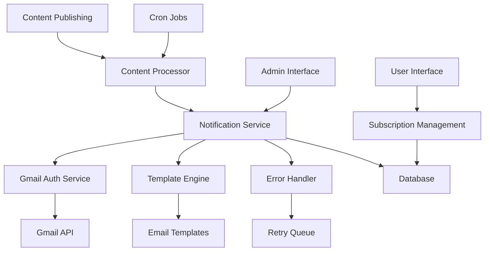
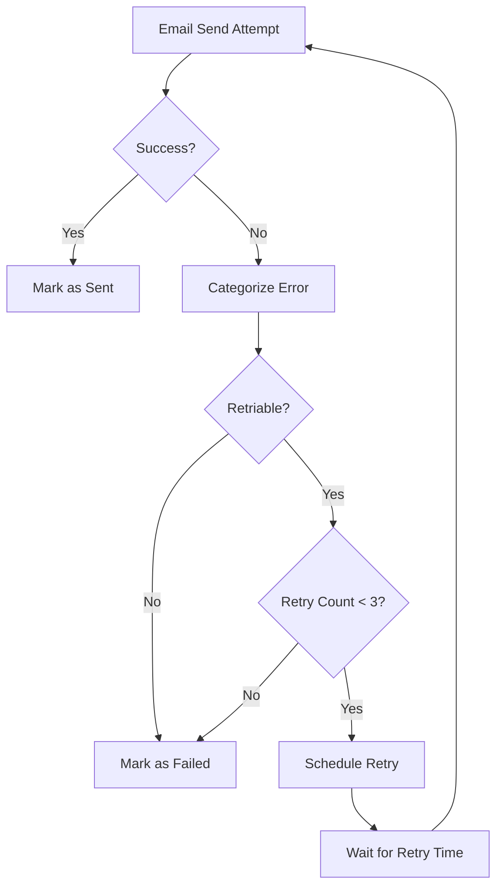

# Email Notification System Design

## Overview

The email notification system is designed to reliably deliver email updates to subscribed users when new blog posts, thoughts, or announcements are published. The system uses Gmail's API for email delivery, implements robust error handling and retry logic, and provides comprehensive monitoring and management capabilities.

The current implementation has the core architecture in place but suffers from configuration issues, inadequate error handling, and reliability problems that prevent emails from being sent successfully.

## Architecture

### High-Level Architecture



### Service Layer Architecture

The system follows a layered service architecture:

1. **Presentation Layer**: Web interfaces for user subscription management and admin monitoring
2. **Service Layer**: Core business logic for notifications, authentication, and content processing
3. **Data Layer**: Database operations and external API integrations
4. **Infrastructure Layer**: Cron jobs, monitoring, and system utilities

## Components and Interfaces

### Core Services

#### EmailNotificationService
- **Purpose**: Orchestrates the email notification process
- **Key Methods**:
  - `sendBlogNotification(post: BlogPost)`: Sends notifications for new blog posts
  - `sendThoughtNotification(thought: Thought)`: Sends notifications for new thoughts
  - `processFailedNotifications()`: Handles retry logic for failed notifications
  - `getNotificationStats()`: Provides system statistics

#### GmailAuth
- **Purpose**: Manages Gmail OAuth2 authentication and token refresh
- **Key Methods**:
  - `getValidAccessToken()`: Returns a valid access token, refreshing if necessary
  - `refreshAccessToken()`: Refreshes the OAuth2 access token
  - `sendEmail(to, subject, html, text)`: Sends email via Gmail API

#### ContentProcessor
- **Purpose**: Detects new content and triggers notifications
- **Key Methods**:
  - `processNewContent()`: Scans for new content and triggers notifications
  - `syncContentFromFiles()`: Synchronizes content metadata with database

#### EmailTemplateEngine
- **Purpose**: Renders email templates with dynamic content
- **Key Methods**:
  - `renderBlogNotification()`: Renders blog notification emails
  - `renderThoughtNotification()`: Renders thought notification emails
  - `renderWelcomeEmail()`: Renders welcome emails for new subscribers

#### EmailErrorHandler
- **Purpose**: Categorizes errors and implements retry logic
- **Key Methods**:
  - `handleEmailError()`: Processes and categorizes email errors
  - `categorizeError()`: Determines error type and retry strategy

### Data Models

#### EmailNotification
```typescript
interface EmailNotification {
  id: string;
  userId: string;
  contentType: 'blog' | 'thought' | 'announcement';
  contentId: string;
  contentTitle: string;
  contentUrl: string;
  contentExcerpt?: string;
  notificationType: 'new_content' | 'announcement';
  status: 'pending' | 'sent' | 'failed' | 'cancelled';
  errorMessage?: string;
  emailMessageId?: string;
  retryCount: number;
  retryAfter?: number;
  createdAt: Date;
  updatedAt: Date;
}
```

#### User (Email-related fields)
```typescript
interface User {
  id: string;
  email: string;
  emailBlogUpdates: boolean;
  emailThoughtUpdates: boolean;
  emailAnnouncements: boolean;
  emailSubscription: boolean;
  subscriptionPreferences?: EmailPreferences;
}
```

## Error Handling

### Error Categories

1. **Retriable Errors**:
   - Rate limiting (429 errors)
   - Temporary service unavailability (5xx errors)
   - Network timeouts
   - Quota exceeded (with backoff)

2. **Non-Retriable Errors**:
   - Invalid email addresses (400 errors)
   - Authentication failures (401/403 errors)
   - Malformed requests (400 errors)
   - Permanent delivery failures

### Retry Strategy

- **Exponential Backoff**: Retry delays increase exponentially (1min, 2min, 4min, 8min)
- **Maximum Retries**: 3 attempts before marking as permanently failed
- **Circuit Breaker**: Temporarily disable email sending if failure rate exceeds threshold
- **Rate Limiting**: Implement delays between batches to respect API limits

### Error Recovery



## Configuration Management

### Required Environment Variables

#### Gmail OAuth Configuration
- `GMAIL_CLIENT_ID`: OAuth2 client ID from Google Cloud Console
- `GMAIL_CLIENT_SECRET`: OAuth2 client secret
- `GMAIL_REFRESH_TOKEN`: Long-lived refresh token for authentication
- `GMAIL_SENDER_EMAIL`: Email address used as sender

#### Site Configuration
- `SITE_NAME`: Display name for the website
- `SITE_URL`: Base URL for generating links in emails
- `CRON_SECRET`: Secret token for authenticating cron requests

### Configuration Validation

The system must validate all required configuration on startup:

1. **Gmail Credentials**: Verify all OAuth credentials are present and valid
2. **Token Refresh**: Test token refresh capability during initialization
3. **Email Sending**: Perform a test email send during deployment verification
4. **Database Schema**: Verify all required tables and indexes exist

## Testing Strategy

### Unit Tests

1. **Service Layer Tests**:
   - EmailNotificationService: Test notification creation and processing
   - GmailAuth: Test token refresh and email sending logic
   - EmailTemplateEngine: Test template rendering with various data
   - EmailErrorHandler: Test error categorization and retry logic

2. **Database Tests**:
   - AuthDB: Test all email-related database operations
   - Data integrity: Test foreign key constraints and data validation

### Integration Tests

1. **Email Flow Tests**:
   - End-to-end notification processing
   - Error handling and retry scenarios
   - Template rendering with real data

2. **API Tests**:
   - Gmail API integration with mocked responses
   - OAuth token refresh flows
   - Rate limiting and error responses

### Performance Tests

1. **Load Testing**:
   - Batch processing performance with large subscriber lists
   - Database query performance under load
   - Memory usage during bulk operations

2. **Reliability Testing**:
   - Error recovery scenarios
   - Circuit breaker functionality
   - Long-running process stability

## Monitoring and Observability

### Metrics Collection

1. **Email Metrics**:
   - Total notifications sent/failed/pending
   - Delivery success rates by content type
   - Average processing time per notification
   - Error rates by category

2. **System Metrics**:
   - OAuth token refresh frequency and success rate
   - Database query performance
   - Memory and CPU usage during processing

### Logging Strategy

1. **Structured Logging**:
   - Use consistent log formats with correlation IDs
   - Include context information (user ID, notification ID, content type)
   - Log performance metrics and error details

2. **Log Levels**:
   - ERROR: Failed operations requiring attention
   - WARN: Recoverable issues and rate limiting
   - INFO: Normal operations and state changes
   - DEBUG: Detailed execution flow for troubleshooting

### Alerting

1. **Critical Alerts**:
   - Email sending completely failing
   - OAuth authentication failures
   - Database connection issues

2. **Warning Alerts**:
   - High error rates (>10% failures)
   - Approaching rate limits
   - Long processing delays

## Security Considerations

### Authentication Security

1. **OAuth Token Management**:
   - Secure storage of refresh tokens
   - Automatic token rotation
   - Minimal token scope (Gmail send only)

2. **API Security**:
   - Cron endpoint authentication
   - Admin interface authorization
   - Rate limiting on public endpoints

### Data Protection

1. **Email Privacy**:
   - Secure unsubscribe token generation
   - Time-limited unsubscribe links
   - No email content logging

2. **User Data**:
   - Encrypted storage of sensitive data
   - GDPR compliance for EU users
   - Data retention policies

## Deployment and Operations

### Deployment Requirements

1. **Environment Setup**:
   - Configure all required environment variables
   - Set up Gmail OAuth2 application
   - Initialize database schema

2. **Verification Steps**:
   - Test Gmail API connectivity
   - Verify template rendering
   - Confirm cron job scheduling

### Operational Procedures

1. **Monitoring**:
   - Daily review of email delivery metrics
   - Weekly analysis of error patterns
   - Monthly performance optimization review

2. **Maintenance**:
   - Regular cleanup of old notification records
   - OAuth token health monitoring
   - Database performance optimization

### Disaster Recovery

1. **Backup Strategy**:
   - Regular database backups
   - Configuration backup and versioning
   - Template and content backup

2. **Recovery Procedures**:
   - Failed notification recovery process
   - OAuth token regeneration steps
   - Service restoration checklist