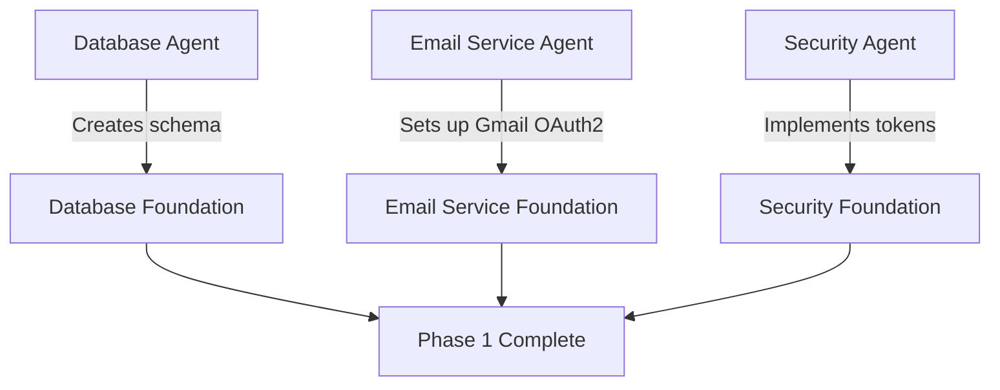
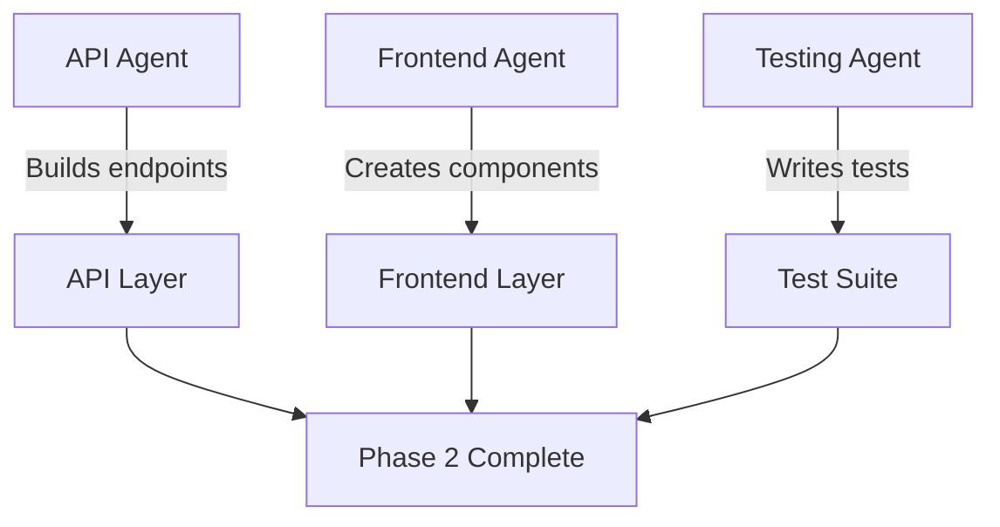
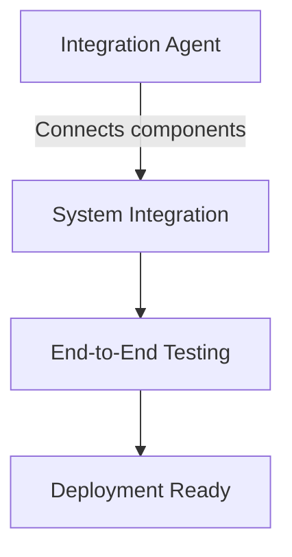

# Parallel Subagent Workflow Design

## Overview
This document outlines the parallel subagent workflow design for implementing the email notifications system. The workflow is designed to maximize development efficiency by enabling multiple AI agents to work on different aspects of the implementation simultaneously.

## Workflow Architecture

### Agent Specialization
Each subagent is assigned specific domain expertise and responsibilities:

1. **Database Agent** - Database schema, migrations, and data layer
2. **Email Service Agent** - Gmail OAuth2 integration and email sending
3. **API Agent** - Backend API endpoints and business logic
4. **Frontend Agent** - User interface and frontend components
5. **Security Agent** - Authentication, authorization, and security measures
6. **Testing Agent** - Test implementation and validation
7. **Integration Agent** - System integration and orchestration

### Parallel Development Strategy

#### Phase 1: Foundation (Parallel)
**Duration**: 2-3 days  
**Agents**: Database, Email Service, Security



#### Phase 2: Core Services (Parallel)
**Duration**: 2-3 days  
**Agents**: API, Frontend, Testing



#### Phase 3: Integration (Sequential)
**Duration**: 1-2 days  
**Agent**: Integration



## Agent Specifications

### Database Agent
**Primary Responsibilities:**
- Database schema design and implementation
- Migration script creation and testing
- Data layer method implementation
- Database performance optimization

**Deliverables:**
- Complete database schema with all tables and indexes
- Migration scripts for all schema changes
- Enhanced AuthDB class with email notification methods
- Database performance testing results

**Tools and Files:**
- Database migration files (`migrations/000X_*.sql`)
- AuthDB class extensions (`src/lib/auth/db.ts`)
- Database testing scripts
- Performance benchmarking tools

**Dependencies:**
- None (can start immediately)

**Validation Criteria:**
- All migrations execute successfully
- Database queries perform within acceptable limits (<100ms)
- Data integrity constraints are properly enforced
- All database methods have proper error handling

### Email Service Agent
**Primary Responsibilities:**
- Gmail OAuth2 integration setup
- Email template system development
- Email sending service implementation
- Unsubscribe token system

**Deliverables:**
- Gmail OAuth2 authentication service
- Email template engine with HTML/text rendering
- Notification processing service
- Unsubscribe token management system

**Tools and Files:**
- Gmail auth service (`src/lib/email/gmail-auth.ts`)
- Template engine (`src/lib/email/template-engine.ts`)
- Notification service (`src/lib/email/notification-service.ts`)
- Unsubscribe service (`src/lib/email/unsubscribe-service.ts`)

**Dependencies:**
- Google Cloud OAuth2 client setup
- Environment variable configuration

**Validation Criteria:**
- OAuth2 token refresh works automatically
- Email templates render correctly
- Emails are sent successfully through Gmail API
- Unsubscribe links are generated and validated

### API Agent
**Primary Responsibilities:**
- API endpoint implementation
- Business logic development
- Error handling and validation
- API documentation

**Deliverables:**
- Email preference management endpoints
- Unsubscribe API endpoints
- Admin notification management APIs
- Comprehensive error handling

**Tools and Files:**
- API route files (`src/pages/api/user/preferences.ts`)
- API route files (`src/pages/api/user/unsubscribe.ts`)
- API route files (`src/pages/api/admin/notifications.ts`)
- Validation middleware and helpers

**Dependencies:**
- Database schema (from Database Agent)
- Email service interfaces (from Email Service Agent)

**Validation Criteria:**
- All API endpoints respond correctly
- Request validation works properly
- Error responses are consistent and helpful
- Authentication and authorization function correctly

### Frontend Agent
**Primary Responsibilities:**
- User interface component development
- Form handling and validation
- User experience optimization
- Responsive design implementation

**Deliverables:**
- Email preference management UI
- Unsubscribe page interface
- Profile page enhancements
- Form validation and error handling

**Tools and Files:**
- Profile page components (`src/pages/profile.astro`)
- Unsubscribe page (`src/pages/unsubscribe.astro`)
- Preference management components
- CSS styling and responsive design

**Dependencies:**
- API endpoints (from API Agent)
- Authentication system (existing)

**Validation Criteria:**
- All forms submit and validate correctly
- User interface is responsive and accessible
- Error messages are clear and helpful
- Loading states provide good user feedback

### Security Agent
**Primary Responsibilities:**
- Authentication system integration
- Security token implementation
- Input validation and sanitization
- Security audit and testing

**Deliverables:**
- Unsubscribe token security system
- Enhanced authentication middleware
- Input validation helpers
- Security audit report

**Tools and Files:**
- Token generation utilities (`src/lib/security/tokens.ts`)
- Validation middleware (`src/lib/security/validation.ts`)
- Security testing scripts
- Audit documentation

**Dependencies:**
- Database schema (from Database Agent)
- Authentication system (existing)

**Validation Criteria:**
- Tokens are cryptographically secure
- Input validation prevents injection attacks
- Authentication and authorization work correctly
- Security audit passes all checks

### Testing Agent
**Primary Responsibilities:**
- Test suite development
- Integration testing
- Performance testing
- Quality assurance

**Deliverables:**
- Comprehensive unit test suite
- Integration test scenarios
- Performance test results
- Quality assurance documentation

**Tools and Files:**
- Test files (`src/tests/**/*.test.ts`)
- Test configuration (`vitest.config.ts`)
- Integration test scripts
- Performance benchmarking

**Dependencies:**
- All other agents' deliverables for testing

**Validation Criteria:**
- All tests pass consistently
- Code coverage meets requirements (>80%)
- Performance tests validate acceptable response times
- Integration tests verify end-to-end functionality

### Integration Agent
**Primary Responsibilities:**
- System component integration
- End-to-end testing
- Deployment coordination
- Final system validation

**Deliverables:**
- Integrated system with all components working together
- End-to-end test results
- Deployment documentation
- System validation report

**Tools and Files:**
- Integration scripts
- Deployment configuration
- System validation tests
- Documentation updates

**Dependencies:**
- All other agents' completed deliverables

**Validation Criteria:**
- All system components work together seamlessly
- End-to-end user flows function correctly
- System performance meets requirements
- Deployment is successful and stable

## Task Assignment and Coordination

### Agent Task Templates

#### Database Agent Tasks
```yaml
Task: "Implement database schema for email notifications"
Files to create:
  - migrations/0004_add_email_notifications.sql
  - migrations/0005_add_email_history.sql
  - migrations/0006_add_content_tracking.sql
  - migrations/0007_add_email_templates.sql
  - migrations/0008_add_unsubscribe_tokens.sql
  - migrations/0009_enhance_users_for_email.sql
  - migrations/0010_add_email_statistics.sql

Instructions:
  - Create all database tables with proper indexes
  - Add foreign key constraints for data integrity
  - Implement migration scripts with rollback capability
  - Extend AuthDB class with email notification methods
  - Add comprehensive error handling
  - Test all database operations
  - Optimize queries for performance

Success criteria:
  - All migrations execute without errors
  - Database queries perform within 100ms
  - Data integrity is maintained
  - All methods have proper error handling
```

#### Email Service Agent Tasks
```yaml
Task: "Implement Gmail OAuth2 email service"
Files to create:
  - src/lib/email/gmail-auth.ts
  - src/lib/email/template-engine.ts
  - src/lib/email/notification-service.ts
  - src/lib/email/unsubscribe-service.ts
  - src/lib/email/error-handler.ts

Instructions:
  - Set up Gmail OAuth2 authentication with token caching
  - Create email template system with HTML/text rendering
  - Implement notification processing with batch handling
  - Add unsubscribe token generation and validation
  - Include comprehensive error handling and retry logic
  - Test email sending functionality
  - Optimize for rate limiting and performance

Success criteria:
  - OAuth2 tokens refresh automatically
  - Email templates render correctly
  - Emails send successfully through Gmail API
  - Unsubscribe system works end-to-end
  - Error handling covers all failure scenarios
```

#### API Agent Tasks
```yaml
Task: "Implement API endpoints for email preferences"
Files to create:
  - src/pages/api/user/preferences.ts
  - src/pages/api/user/unsubscribe.ts
  - src/pages/api/admin/notifications.ts
  - src/pages/api/cron/process-notifications.ts

Instructions:
  - Create preference management endpoints (GET/PUT)
  - Implement unsubscribe API endpoint
  - Add admin notification management APIs
  - Include comprehensive validation and error handling
  - Test all endpoints with various scenarios
  - Add proper authentication and authorization
  - Document API endpoints and responses

Success criteria:
  - All endpoints respond correctly
  - Request validation works properly
  - Error responses are consistent
  - Authentication works correctly
  - All endpoints are properly documented
```

#### Frontend Agent Tasks
```yaml
Task: "Implement user interface for email preferences"
Files to create:
  - src/pages/profile.astro (enhance existing)
  - src/pages/unsubscribe.astro
  - src/components/EmailPreferences.astro
  - src/components/UnsubscribeForm.astro

Instructions:
  - Create email preference management UI
  - Implement unsubscribe page interface
  - Add form validation and error handling
  - Ensure responsive design for all devices
  - Test user experience and accessibility
  - Add loading states and success feedback
  - Follow existing design patterns

Success criteria:
  - All forms submit and validate correctly
  - UI is responsive and accessible
  - Error messages are clear and helpful
  - Loading states provide good feedback
  - Design is consistent with existing site
```

### Communication Protocols

#### Agent Communication Format
```markdown
## Agent Status Report

**Agent**: Database Agent
**Phase**: 1 (Foundation)
**Status**: In Progress
**Progress**: 70% Complete

### Completed Tasks
- ✅ Created email_notifications table
- ✅ Created email_notification_history table
- ✅ Added proper indexes for performance

### In Progress
- 🔄 Implementing AuthDB class extensions
- 🔄 Creating migration rollback scripts

### Blocked/Issues
- ❌ None currently

### Next Steps
- Complete AuthDB method implementations
- Test all database operations
- Optimize query performance

### Dependencies Needed
- None

### Deliverables Ready
- Database schema files
- Migration scripts (partial)

### Estimated Completion
- 1 day remaining
```

#### Cross-Agent Dependencies
```yaml
Dependencies:
  Email Service Agent:
    needs_from: [Database Agent]
    provides_to: [API Agent, Integration Agent]
    
  API Agent:
    needs_from: [Database Agent, Email Service Agent]
    provides_to: [Frontend Agent, Integration Agent]
    
  Frontend Agent:
    needs_from: [API Agent]
    provides_to: [Integration Agent]
    
  Integration Agent:
    needs_from: [Database Agent, Email Service Agent, API Agent, Frontend Agent, Security Agent, Testing Agent]
    provides_to: [Deployment]
```

## Quality Assurance Framework

### Code Quality Standards
- All code must pass linting checks
- TypeScript strict mode compliance
- Comprehensive error handling
- Proper logging and monitoring
- Security best practices

### Testing Requirements
- Unit tests for all business logic
- Integration tests for API endpoints
- End-to-end tests for user flows
- Performance tests for critical paths
- Security tests for authentication

### Documentation Standards
- Inline code documentation
- API endpoint documentation
- Database schema documentation
- Deployment procedures
- User guide updates

## Deployment Coordination

### Deployment Phases
1. **Development**: Each agent deploys to their own branch
2. **Integration**: Integration agent merges all branches
3. **Staging**: Full system testing in staging environment
4. **Production**: Coordinated production deployment

### Deployment Checklist
- [ ] All database migrations tested
- [ ] Environment variables configured
- [ ] Gmail OAuth2 credentials set up
- [ ] Email templates populated
- [ ] API endpoints tested
- [ ] Frontend components functional
- [ ] Security measures validated
- [ ] Performance benchmarks met
- [ ] End-to-end testing passed
- [ ] Monitoring and alerting configured

## Success Metrics

### Technical Metrics
- **Database Performance**: All queries < 100ms
- **Email Delivery**: >98% success rate
- **API Response Time**: <200ms average
- **System Uptime**: 99.9% availability
- **Code Coverage**: >80% test coverage

### User Experience Metrics
- **Preference Updates**: 100% success rate
- **Unsubscribe Flow**: One-click functionality
- **Form Validation**: Clear error messages
- **Mobile Responsiveness**: Full functionality
- **Accessibility**: WCAG 2.1 AA compliance

### Business Metrics
- **User Engagement**: Email open rates >20%
- **Unsubscribe Rate**: <2% monthly
- **System Reliability**: <0.1% error rate
- **User Satisfaction**: Positive feedback
- **Feature Adoption**: >50% users enable notifications

## Risk Management

### Technical Risks
- **Gmail API Rate Limits**: Implement batching and retry logic
- **Database Performance**: Optimize queries and add indexes
- **Email Deliverability**: Monitor bounce rates and reputation
- **Security Vulnerabilities**: Regular security audits

### Mitigation Strategies
- **Automated Testing**: Comprehensive test suite
- **Monitoring**: Real-time system monitoring
- **Rollback Plans**: Quick rollback procedures
- **Documentation**: Detailed operational procedures

## Implementation Timeline

### Week 1: Foundation
- Database Agent: Complete schema and migrations
- Email Service Agent: Gmail OAuth2 setup
- Security Agent: Token system implementation

### Week 2: Core Services
- API Agent: Endpoint implementation
- Frontend Agent: UI component development
- Testing Agent: Test suite creation

### Week 3: Integration
- Integration Agent: System integration
- All Agents: Bug fixes and optimizations
- Testing Agent: End-to-end validation

### Week 4: Deployment
- Integration Agent: Production deployment
- All Agents: Monitoring and support
- Testing Agent: Post-deployment validation

This parallel subagent workflow design ensures efficient development while maintaining quality and coordination across all aspects of the email notifications system implementation.