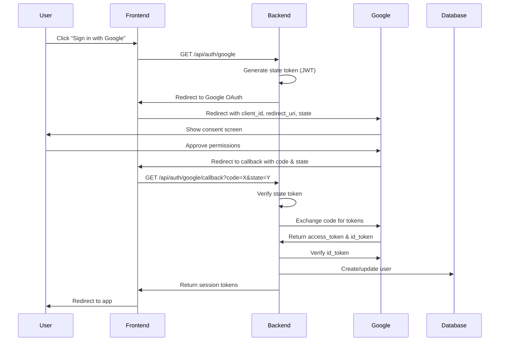

# Comprehensive Guide to Implementing Google Sign-In with OAuth 2.0

This guide provides a complete, production-ready implementation of Google Sign-In using OAuth 2.0 for modern web applications. Based on battle-tested implementations from real-world projects, this guide covers everything from initial setup to advanced security considerations.

## Table of Contents

1. [Overview](#overview)
2. [Prerequisites](#prerequisites)
3. [Google Cloud Console Setup](#google-cloud-console-setup)
4. [Architecture Overview](#architecture-overview)
5. [Backend Implementation](#backend-implementation)
6. [Frontend Implementation](#frontend-implementation)
7. [Security Best Practices](#security-best-practices)
8. [Account Management](#account-management)
9. [Error Handling](#error-handling)
10. [Testing and Debugging](#testing-and-debugging)
11. [Production Deployment](#production-deployment)
12. [Common Pitfalls and Solutions](#common-pitfalls-and-solutions)

## Overview

Google Sign-In provides a secure, user-friendly authentication method that leverages Google's OAuth 2.0 implementation. This guide demonstrates how to implement a complete authentication system that:

- Allows users to sign in with their Google account
- Creates new accounts automatically
- Links Google accounts to existing email-based accounts
- Implements comprehensive security measures
- Provides a smooth user experience

### OAuth 2.0 Flow Overview



## Prerequisites

Before implementing Google Sign-In, ensure you have:

1. **A Google Cloud Project** with OAuth 2.0 configured
2. **A web application** (this guide covers React, Astro, and vanilla JavaScript)
3. **A backend API** (this guide uses Cloudflare Workers, but principles apply to any backend)
4. **A database** for user storage (D1, PostgreSQL, MongoDB, etc.)
5. **HTTPS enabled** (required for production OAuth)

## Google Cloud Console Setup

### Important Notes

- **Client Secret Security**: As of 2025, OAuth 2.0 client secrets are hashed and only visible at creation time. Save them immediately!
- **Auto-deletion Policy**: OAuth clients that remain inactive for 6 months are automatically deleted. You'll receive email notifications 30 days before deletion.
- **Enhanced Security**: OAuth clients created after June 2025 have additional security features enabled by default.

### Step 1: Create OAuth 2.0 Credentials

1. Navigate to [Google Cloud Console](https://console.cloud.google.com/)
2. Create a new project or select an existing one
3. Go to **APIs & Services** → **Credentials**
4. Click **+ CREATE CREDENTIALS** → **OAuth client ID**
5. Select **Web application** as the application type
6. Configure the following:

```
Application name: Your App Name

Authorized JavaScript origins:
- http://localhost:3000 (development)
- https://yourdomain.com (production)

Authorized redirect URIs:
- http://localhost:3000/api/auth/google/callback (development)
- https://yourdomain.com/api/auth/google/callback (production)
```

7. Save your `Client ID` and `Client Secret`

### Step 2: Configure OAuth Consent Screen

1. Go to **APIs & Services** → **OAuth consent screen**
2. Choose **External** user type (unless using Google Workspace)
3. Fill in required information:
   - App name
   - User support email
   - App logo (optional but recommended)
   - App domain
   - Privacy policy URL
   - Terms of service URL

4. Add scopes:
   - `openid` - Required for OpenID Connect
   - `profile` - Access to user's basic profile
   - `email` - Access to user's email address

### Step 3: Enable Required APIs

1. Go to **APIs & Services** → **Library**
2. For most OAuth implementations, no additional APIs need to be enabled
3. The OAuth 2.0 and OpenID Connect endpoints are available by default
4. If you need additional user data, consider enabling:
   - Google People API (for extended profile information)
   - Gmail API (if you need email-related features)

## Architecture Overview

A production-ready Google OAuth implementation consists of several key components:

### Backend Components

```
/backend
├── /routes
│   └── /auth
│       └── google-oauth.ts    # OAuth route handlers
├── /services
│   └── /auth
│       ├── google-oauth-service.ts    # OAuth business logic
│       ├── oauth-state-manager.ts     # CSRF protection
│       └── oauth-rate-limiter.ts      # Rate limiting
├── /middleware
│   └── oauth-security.ts              # Security middleware
└── /config
    └── oauth-config.ts                # OAuth configuration
```

### Frontend Components

```
/frontend
├── /components
│   └── GoogleSignInButton.jsx         # UI component
├── /context
│   └── AuthContext.jsx                # Auth state management
├── /utils
│   └── auth.js                        # Token management
└── /api
    └── auth.js                        # API client
```

### Database Schema

```sql
-- Users table with OAuth support
CREATE TABLE users (
    id INTEGER PRIMARY KEY AUTOINCREMENT,
    email TEXT UNIQUE NOT NULL,
    username TEXT,
    password_hash TEXT,
    provider TEXT DEFAULT 'email',
    google_id TEXT UNIQUE,
    profile_picture_url TEXT,
    email_verified BOOLEAN DEFAULT FALSE,
    created_at TIMESTAMP DEFAULT CURRENT_TIMESTAMP,
    updated_at TIMESTAMP DEFAULT CURRENT_TIMESTAMP
);

-- OAuth state management
CREATE TABLE oauth_states (
    state TEXT PRIMARY KEY,
    data TEXT NOT NULL,
    expires_at TIMESTAMP NOT NULL,
    created_at TIMESTAMP DEFAULT CURRENT_TIMESTAMP
);

-- Security events for monitoring
CREATE TABLE oauth_security_events (
    id INTEGER PRIMARY KEY AUTOINCREMENT,
    event_type TEXT NOT NULL,
    ip_address TEXT,
    user_id INTEGER,
    details TEXT,
    created_at TIMESTAMP DEFAULT CURRENT_TIMESTAMP
);
```

## Backend Implementation

### 1. OAuth Configuration

```typescript
// config/oauth-config.ts
export interface OAuthConfig {
  clientId: string;
  clientSecret: string;
  redirectUri: string;
  authorizationEndpoint: string;
  tokenEndpoint: string;
  userInfoEndpoint: string;
  scopes: string[];
}

export const googleOAuthConfig: OAuthConfig = {
  clientId: process.env.GOOGLE_CLIENT_ID!,
  clientSecret: process.env.GOOGLE_CLIENT_SECRET!,
  redirectUri: process.env.GOOGLE_REDIRECT_URI || 'http://localhost:8787/api/v1/auth/google/callback',
  authorizationEndpoint: 'https://accounts.google.com/o/oauth2/v2/auth',
  tokenEndpoint: 'https://oauth2.googleapis.com/token',
  userInfoEndpoint: 'https://www.googleapis.com/oauth2/v3/userinfo', // Latest version
  // Alternative endpoints:
  // - 'https://openidconnect.googleapis.com/v1/userinfo' (OpenID Connect)
  // - 'https://people.googleapis.com/v1/people/me' (People API, requires additional scope)
  scopes: ['openid', 'profile', 'email']
};
```

### 2. State Manager for CSRF Protection

```typescript
// services/auth/oauth-state-manager.ts
import jwt from '@tsndr/cloudflare-worker-jwt';

interface StatePayload {
  returnUrl?: string;
  linkAccount?: boolean;
  userId?: number;
  nonce: string;
  exp: number;
}

export class OAuthStateManager {
  private readonly jwtSecret: string;
  private readonly expirationMinutes = 10;

  constructor(jwtSecret: string) {
    this.jwtSecret = jwtSecret;
  }

  async generateState(data: Omit<StatePayload, 'nonce' | 'exp'>): Promise<string> {
    const payload: StatePayload = {
      ...data,
      nonce: crypto.randomUUID(),
      exp: Math.floor(Date.now() / 1000) + (this.expirationMinutes * 60)
    };

    return await jwt.sign(payload, this.jwtSecret);
  }

  async verifyState(state: string): Promise<StatePayload | null> {
    try {
      const isValid = await jwt.verify(state, this.jwtSecret);
      if (!isValid) return null;

      const decoded = jwt.decode<StatePayload>(state);
      
      // Check expiration
      if (decoded.payload.exp < Math.floor(Date.now() / 1000)) {
        return null;
      }

      return decoded.payload;
    } catch (error) {
      return null;
    }
  }
}
```

### 3. Rate Limiter

```typescript
// services/auth/oauth-rate-limiter.ts
export class OAuthRateLimiter {
  private readonly limits = {
    ip: { requests: 10, windowMinutes: 15 },
    user: { requests: 20, windowMinutes: 60 },
    failures: { attempts: 5, windowMinutes: 30 }
  };

  constructor(private db: D1Database) {}

  async checkRateLimit(type: 'ip' | 'user' | 'failures', identifier: string): Promise<boolean> {
    const limit = this.limits[type];
    const windowStart = new Date(Date.now() - limit.windowMinutes * 60 * 1000);

    const result = await this.db.prepare(`
      SELECT COUNT(*) as count
      FROM oauth_rate_limits
      WHERE type = ? AND identifier = ? AND created_at > ?
    `).bind(type, identifier, windowStart.toISOString()).first<{ count: number }>();

    if (result && result.count >= limit.requests) {
      return false; // Rate limit exceeded
    }

    // Record this attempt
    await this.db.prepare(`
      INSERT INTO oauth_rate_limits (type, identifier, created_at)
      VALUES (?, ?, ?)
    `).bind(type, identifier, new Date().toISOString()).run();

    return true;
  }

  async recordFailure(ipAddress: string, userId?: number): Promise<void> {
    const identifier = userId ? `user:${userId}` : `ip:${ipAddress}`;
    await this.checkRateLimit('failures', identifier);
  }
}
```

### 4. OAuth Service

```typescript
// services/auth/google-oauth-service.ts
export class GoogleOAuthService {
  constructor(
    private config: OAuthConfig,
    private db: D1Database,
    private stateManager: OAuthStateManager,
    private rateLimiter: OAuthRateLimiter
  ) {}

  async initiateOAuth(request: Request, options?: { returnUrl?: string; linkAccount?: boolean; userId?: number }): Promise<Response> {
    const clientIP = request.headers.get('CF-Connecting-IP') || 'unknown';
    
    // Rate limiting
    if (!await this.rateLimiter.checkRateLimit('ip', clientIP)) {
      return new Response('Too many requests', { status: 429 });
    }

    // Generate state token
    const state = await this.stateManager.generateState({
      returnUrl: options?.returnUrl,
      linkAccount: options?.linkAccount,
      userId: options?.userId
    });

    // Build authorization URL
    const params = new URLSearchParams({
      client_id: this.config.clientId,
      redirect_uri: this.config.redirectUri,
      response_type: 'code',
      scope: this.config.scopes.join(' '),
      state,
      access_type: 'offline',
      prompt: 'select_account'
    });

    const authUrl = `${this.config.authorizationEndpoint}?${params}`;
    
    return Response.redirect(authUrl, 302);
  }

  async handleCallback(request: Request): Promise<Response> {
    const url = new URL(request.url);
    const code = url.searchParams.get('code');
    const state = url.searchParams.get('state');
    const error = url.searchParams.get('error');

    // Handle OAuth errors
    if (error) {
      return Response.redirect(`/auth/error?reason=${error}`, 302);
    }

    if (!code || !state) {
      return new Response('Missing required parameters', { status: 400 });
    }

    // Verify state
    const stateData = await this.stateManager.verifyState(state);
    if (!stateData) {
      return new Response('Invalid or expired state', { status: 400 });
    }

    try {
      // Exchange code for tokens
      const tokens = await this.exchangeCodeForTokens(code);
      
      // Verify ID token
      const userInfo = await this.verifyIdToken(tokens.id_token);
      
      // Create or update user
      const user = await this.createOrUpdateUser(userInfo, stateData);
      
      // Generate session tokens
      const sessionTokens = await this.generateSessionTokens(user);
      
      // Build redirect URL with tokens
      const redirectUrl = new URL(stateData.returnUrl || '/dashboard');
      redirectUrl.searchParams.set('token', sessionTokens.accessToken);
      redirectUrl.searchParams.set('refresh_token', sessionTokens.refreshToken);
      
      return Response.redirect(redirectUrl.toString(), 302);
    } catch (error) {
      console.error('OAuth callback error:', error);
      return Response.redirect('/auth/error?reason=oauth_failed', 302);
    }
  }

  private async exchangeCodeForTokens(code: string): Promise<any> {
    const params = new URLSearchParams({
      code,
      client_id: this.config.clientId,
      client_secret: this.config.clientSecret,
      redirect_uri: this.config.redirectUri,
      grant_type: 'authorization_code'
    });

    const response = await fetch(this.config.tokenEndpoint, {
      method: 'POST',
      headers: { 'Content-Type': 'application/x-www-form-urlencoded' },
      body: params
    });

    if (!response.ok) {
      throw new Error('Failed to exchange code for tokens');
    }

    return response.json();
  }

  private async verifyIdToken(idToken: string): Promise<any> {
    // Use Google's tokeninfo endpoint for verification
    const response = await fetch(`https://oauth2.googleapis.com/tokeninfo?id_token=${idToken}`);
    
    if (!response.ok) {
      throw new Error('Invalid ID token');
    }

    const tokenInfo = await response.json();
    
    // Verify audience
    if (tokenInfo.aud !== this.config.clientId) {
      throw new Error('Token audience mismatch');
    }
    
    // Verify token hasn't expired
    if (tokenInfo.exp < Math.floor(Date.now() / 1000)) {
      throw new Error('Token expired');
    }
    
    // Verify issuer
    if (tokenInfo.iss !== 'https://accounts.google.com' && tokenInfo.iss !== 'accounts.google.com') {
      throw new Error('Invalid token issuer');
    }

    // Note: tokeninfo returns fields like: sub, email, email_verified, name, picture, given_name, family_name
    return tokenInfo;
  }

  private async createOrUpdateUser(googleUser: any, stateData: StatePayload): Promise<any> {
    // Check if linking to existing account
    if (stateData.linkAccount && stateData.userId) {
      return this.linkGoogleAccount(stateData.userId, googleUser);
    }

    // Check if user exists with this Google ID
    let user = await this.db.prepare(`
      SELECT * FROM users WHERE google_id = ?
    `).bind(googleUser.sub).first();

    if (user) {
      // Update existing user
      await this.db.prepare(`
        UPDATE users 
        SET profile_picture_url = ?, updated_at = CURRENT_TIMESTAMP
        WHERE google_id = ?
      `).bind(googleUser.picture, googleUser.sub).run();
      
      return user;
    }

    // Check if user exists with this email
    user = await this.db.prepare(`
      SELECT * FROM users WHERE email = ?
    `).bind(googleUser.email).first();

    if (user) {
      // Link Google account to existing email user
      await this.db.prepare(`
        UPDATE users 
        SET google_id = ?, provider = 'google', profile_picture_url = ?, 
            email_verified = TRUE, updated_at = CURRENT_TIMESTAMP
        WHERE email = ?
      `).bind(googleUser.sub, googleUser.picture, googleUser.email).run();
      
      return this.db.prepare(`
        SELECT * FROM users WHERE email = ?
      `).bind(googleUser.email).first();
    }

    // Create new user
    const result = await this.db.prepare(`
      INSERT INTO users (email, username, provider, google_id, profile_picture_url, email_verified)
      VALUES (?, ?, 'google', ?, ?, TRUE)
    `).bind(
      googleUser.email,
      googleUser.name || googleUser.email.split('@')[0],
      googleUser.sub,
      googleUser.picture
    ).run();

    return this.db.prepare(`
      SELECT * FROM users WHERE id = ?
    `).bind(result.meta.last_row_id).first();
  }

  private async linkGoogleAccount(userId: number, googleUser: any): Promise<any> {
    // Check if Google ID is already linked to another account
    const existing = await this.db.prepare(`
      SELECT id FROM users WHERE google_id = ? AND id != ?
    `).bind(googleUser.sub, userId).first();

    if (existing) {
      throw new Error('This Google account is already linked to another user');
    }

    // Link Google account
    await this.db.prepare(`
      UPDATE users 
      SET google_id = ?, profile_picture_url = ?, updated_at = CURRENT_TIMESTAMP
      WHERE id = ?
    `).bind(googleUser.sub, googleUser.picture, userId).run();

    return this.db.prepare(`
      SELECT * FROM users WHERE id = ?
    `).bind(userId).first();
  }

  private async generateSessionTokens(user: any): Promise<{ accessToken: string; refreshToken: string }> {
    // Implementation depends on your session management system
    // This is a simplified example
    const accessToken = await jwt.sign(
      { userId: user.id, email: user.email },
      this.config.jwtSecret,
      { expiresIn: '1h' }
    );

    const refreshToken = await jwt.sign(
      { userId: user.id, type: 'refresh' },
      this.config.jwtSecret,
      { expiresIn: '30d' }
    );

    return { accessToken, refreshToken };
  }
}
```

### 5. Route Handlers

```typescript
// routes/auth/google-oauth.ts
import { Hono } from 'hono';
import { GoogleOAuthService } from '../../services/auth/google-oauth-service';
import { OAuthStateManager } from '../../services/auth/oauth-state-manager';
import { OAuthRateLimiter } from '../../services/auth/oauth-rate-limiter';

const router = new Hono();

// Initialize OAuth flow
router.get('/google', async (c) => {
  const { env } = c;
  const url = new URL(c.req.url);
  const returnUrl = url.searchParams.get('return_url');
  const mode = url.searchParams.get('mode'); // login, signup, or link

  const stateManager = new OAuthStateManager(env.JWT_SECRET);
  const rateLimiter = new OAuthRateLimiter(env.DB);
  const oauthService = new GoogleOAuthService(
    {
      clientId: env.GOOGLE_CLIENT_ID,
      clientSecret: env.GOOGLE_CLIENT_SECRET,
      redirectUri: env.GOOGLE_REDIRECT_URI,
      // ... other config
    },
    env.DB,
    stateManager,
    rateLimiter
  );

  // Check if user is authenticated (for account linking)
  const userId = c.get('userId'); // From auth middleware
  const linkAccount = mode === 'link' && userId;

  return oauthService.initiateOAuth(c.req.raw, {
    returnUrl,
    linkAccount,
    userId
  });
});

// Handle OAuth callback
router.get('/google/callback', async (c) => {
  const { env } = c;
  
  const stateManager = new OAuthStateManager(env.JWT_SECRET);
  const rateLimiter = new OAuthRateLimiter(env.DB);
  const oauthService = new GoogleOAuthService(
    // ... config
    env.DB,
    stateManager,
    rateLimiter
  );

  return oauthService.handleCallback(c.req.raw);
});

// Check OAuth link status
router.get('/google/status', async (c) => {
  const userId = c.get('userId');
  if (!userId) {
    return c.json({ linked: false });
  }

  const user = await c.env.DB.prepare(`
    SELECT google_id FROM users WHERE id = ?
  `).bind(userId).first();

  return c.json({ linked: !!user?.google_id });
});

// Unlink Google account
router.post('/google/unlink', async (c) => {
  const userId = c.get('userId');
  if (!userId) {
    return c.json({ error: 'Unauthorized' }, 401);
  }

  // Check if user has a password (can't unlink if Google is only auth method)
  const user = await c.env.DB.prepare(`
    SELECT password_hash, provider FROM users WHERE id = ?
  `).bind(userId).first();

  if (!user?.password_hash && user?.provider === 'google') {
    return c.json({ error: 'Cannot unlink Google account without setting a password first' }, 400);
  }

  await c.env.DB.prepare(`
    UPDATE users 
    SET google_id = NULL, updated_at = CURRENT_TIMESTAMP
    WHERE id = ?
  `).bind(userId).run();

  return c.json({ success: true });
});

export default router;
```

## Frontend Implementation

### 1. Google Sign-In Button Component (React)

```jsx
// components/GoogleSignInButton.jsx
import React, { useState } from 'react';
import { useAuth } from '../context/AuthContext';

const GoogleSignInButton = ({ mode = 'login', returnUrl = '/dashboard' }) => {
  const [isLoading, setIsLoading] = useState(false);
  const { user } = useAuth();

  const handleGoogleSignIn = () => {
    setIsLoading(true);
    
    const params = new URLSearchParams({
      return_url: returnUrl,
      mode: mode
    });

    // Redirect to OAuth initiation endpoint
    window.location.href = `/api/v1/auth/google?${params}`;
  };

  const buttonText = {
    login: 'Sign in with Google',
    signup: 'Sign up with Google',
    link: 'Link Google Account'
  }[mode];

  return (
    <button
      onClick={handleGoogleSignIn}
      disabled={isLoading}
      className="google-signin-button"
      aria-label={buttonText}
    >
      <svg className="google-icon" viewBox="0 0 24 24">
        <path d="M22.56 12.25c0-.78-.07-1.53-.2-2.25H12v4.26h5.92c-.26 1.37-1.04 2.53-2.21 3.31v2.77h3.57c2.08-1.92 3.28-4.74 3.28-8.09z" fill="#4285F4"/>
        <path d="M12 23c2.97 0 5.46-.98 7.28-2.66l-3.57-2.77c-.98.66-2.23 1.06-3.71 1.06-2.86 0-5.29-1.93-6.16-4.53H2.18v2.84C3.99 20.53 7.7 23 12 23z" fill="#34A853"/>
        <path d="M5.84 14.09c-.22-.66-.35-1.36-.35-2.09s.13-1.43.35-2.09V7.07H2.18C1.43 8.55 1 10.22 1 12s.43 3.45 1.18 4.93l2.85-2.22.81-.62z" fill="#FBBC05"/>
        <path d="M12 5.38c1.62 0 3.06.56 4.21 1.64l3.15-3.15C17.45 2.09 14.97 1 12 1 7.7 1 3.99 3.47 2.18 7.07l3.66 2.84c.87-2.6 3.3-4.53 6.16-4.53z" fill="#EA4335"/>
      </svg>
      <span>{isLoading ? 'Loading...' : buttonText}</span>
    </button>
  );
};

// Styles
const styles = `
.google-signin-button {
  display: inline-flex;
  align-items: center;
  gap: 12px;
  padding: 10px 24px;
  background-color: #ffffff;
  color: #3c4043;
  border: 1px solid #dadce0;
  border-radius: 4px;
  font-family: 'Roboto', sans-serif;
  font-size: 14px;
  font-weight: 500;
  cursor: pointer;
  transition: all 0.3s ease;
}

.google-signin-button:hover {
  box-shadow: 0 1px 2px 0 rgba(60,64,67,0.3), 0 1px 3px 1px rgba(60,64,67,0.15);
  background-color: #f8f9fa;
}

.google-signin-button:active {
  background-color: #e8eaed;
}

.google-signin-button:disabled {
  opacity: 0.6;
  cursor: not-allowed;
}

.google-icon {
  width: 18px;
  height: 18px;
}
`;

export default GoogleSignInButton;
```

### 2. OAuth Callback Handler

```jsx
// components/OAuthCallback.jsx
import React, { useEffect } from 'react';
import { useNavigate, useSearchParams } from 'react-router-dom';
import { useAuth } from '../context/AuthContext';

const OAuthCallback = () => {
  const [searchParams] = useSearchParams();
  const navigate = useNavigate();
  const { login } = useAuth();

  useEffect(() => {
    const handleCallback = async () => {
      const token = searchParams.get('token');
      const refreshToken = searchParams.get('refresh_token');
      const error = searchParams.get('error');

      if (error) {
        // Handle error
        console.error('OAuth error:', error);
        navigate('/auth/error', { state: { error } });
        return;
      }

      if (token && refreshToken) {
        // Store tokens and update auth state
        await login(token, refreshToken);
        
        // Clean URL
        window.history.replaceState({}, document.title, window.location.pathname);
        
        // Navigate to dashboard or intended destination
        navigate('/dashboard');
      } else {
        navigate('/auth/error', { state: { error: 'Missing tokens' } });
      }
    };

    handleCallback();
  }, [searchParams, navigate, login]);

  return (
    <div className="oauth-callback">
      <div className="loading-spinner">
        <div className="spinner"></div>
        <p>Completing sign in...</p>
      </div>
    </div>
  );
};

export default OAuthCallback;
```

### 3. Account Linking Component

```jsx
// components/AccountLinking.jsx
import React, { useState, useEffect } from 'react';
import { useAuth } from '../context/AuthContext';
import GoogleSignInButton from './GoogleSignInButton';

const AccountLinking = () => {
  const { user, token } = useAuth();
  const [isLinked, setIsLinked] = useState(false);
  const [isLoading, setIsLoading] = useState(true);

  useEffect(() => {
    checkLinkStatus();
  }, []);

  const checkLinkStatus = async () => {
    try {
      const response = await fetch('/api/v1/auth/google/status', {
        headers: {
          'Authorization': `Bearer ${token}`
        }
      });
      const data = await response.json();
      setIsLinked(data.linked);
    } catch (error) {
      console.error('Failed to check link status:', error);
    } finally {
      setIsLoading(false);
    }
  };

  const handleUnlink = async () => {
    if (!confirm('Are you sure you want to unlink your Google account?')) {
      return;
    }

    try {
      const response = await fetch('/api/v1/auth/google/unlink', {
        method: 'POST',
        headers: {
          'Authorization': `Bearer ${token}`
        }
      });

      if (response.ok) {
        setIsLinked(false);
        alert('Google account unlinked successfully');
      } else {
        const error = await response.json();
        alert(error.error || 'Failed to unlink account');
      }
    } catch (error) {
      console.error('Failed to unlink account:', error);
      alert('Failed to unlink account');
    }
  };

  if (isLoading) {
    return <div>Loading...</div>;
  }

  return (
    <div className="account-linking">
      <h3>Google Account</h3>
      {isLinked ? (
        <div>
          <p>Your Google account is linked</p>
          <button onClick={handleUnlink} className="unlink-button">
            Unlink Google Account
          </button>
        </div>
      ) : (
        <div>
          <p>Link your Google account for easier sign in</p>
          <GoogleSignInButton mode="link" returnUrl="/settings" />
        </div>
      )}
    </div>
  );
};

export default AccountLinking;
```

## Security Best Practices

### 1. CSRF Protection

Always use state parameters with cryptographically secure random values:

```typescript
// Good: JWT-signed state with expiration
const state = await jwt.sign({
  nonce: crypto.randomUUID(),
  returnUrl: '/dashboard',
  exp: Date.now() + 600000 // 10 minutes
}, secret);

// Bad: Predictable or no state
const state = 'oauth-state'; // Never do this!
```

### 2. Rate Limiting

Implement multiple layers of rate limiting:

```typescript
const rateLimits = {
  // Per IP address
  ip: {
    requests: 10,
    window: '15 minutes',
    action: 'block'
  },
  
  // Per user account
  user: {
    requests: 20,
    window: '1 hour',
    action: 'throttle'
  },
  
  // Failed attempts
  failures: {
    attempts: 5,
    window: '30 minutes',
    action: 'temporary_ban'
  }
};
```

### 3. Token Validation

Always verify ID tokens properly:

```typescript
// Option 1: Server-side validation using tokeninfo endpoint (simple, good for low volume)
const tokenInfo = await fetch(`https://oauth2.googleapis.com/tokeninfo?id_token=${idToken}`);
if (!tokenInfo.ok) throw new Error('Invalid token');
const data = await tokenInfo.json();
if (data.aud !== clientId) throw new Error('Invalid audience');
if (data.exp < Date.now() / 1000) throw new Error('Token expired');

// Option 2: Use Google's official library (recommended for production)
import { OAuth2Client } from 'google-auth-library';
const client = new OAuth2Client(clientId);
const ticket = await client.verifyIdToken({ 
  idToken, 
  audience: clientId 
});
const payload = ticket.getPayload();

// Option 3: Manual JWT validation (for edge environments)
// Fetch Google's public keys from: https://www.googleapis.com/oauth2/v3/certs
// Verify signature, audience, issuer, and expiration
```

### 4. Secure Token Storage

```javascript
// Frontend: Use httpOnly cookies when possible
document.cookie = `token=${token}; HttpOnly; Secure; SameSite=Strict`;

// Or use secure localStorage with encryption
const encryptedToken = await crypto.subtle.encrypt(
  { name: 'AES-GCM', iv },
  key,
  encoder.encode(token)
);
localStorage.setItem('token', btoa(String.fromCharCode(...new Uint8Array(encryptedToken))));
```

### 5. Content Security Policy

```typescript
// middleware/security-headers.ts
export const securityHeaders = {
  'Content-Security-Policy': [
    "default-src 'self'",
    "script-src 'self' https://accounts.google.com",
    "style-src 'self' 'unsafe-inline' https://accounts.google.com",
    "img-src 'self' https://*.googleusercontent.com data:",
    "connect-src 'self' https://oauth2.googleapis.com https://www.googleapis.com https://openidconnect.googleapis.com",
    "frame-src https://accounts.google.com"
  ].join('; ')
};
```

## Account Management

### 1. Account Linking Logic

```typescript
async function handleAccountLinking(existingUserId: number, googleProfile: GoogleProfile) {
  // Check for conflicts
  const googleUser = await db.getUserByGoogleId(googleProfile.id);
  if (googleUser && googleUser.id !== existingUserId) {
    throw new Error('This Google account is already linked to another user');
  }

  // Check email conflicts
  const emailUser = await db.getUserByEmail(googleProfile.email);
  if (emailUser && emailUser.id !== existingUserId) {
    throw new Error('This email is already associated with another account');
  }

  // Link accounts
  await db.updateUser(existingUserId, {
    googleId: googleProfile.id,
    emailVerified: true,
    profilePicture: googleProfile.picture
  });

  return { success: true, message: 'Google account linked successfully' };
}
```

### 2. Account Merging

```typescript
async function mergeAccounts(primaryUserId: number, googleUserId: number) {
  // Begin transaction
  const tx = await db.transaction();
  
  try {
    // Move all user data to primary account
    await tx.execute('UPDATE posts SET user_id = ? WHERE user_id = ?', [primaryUserId, googleUserId]);
    await tx.execute('UPDATE comments SET user_id = ? WHERE user_id = ?', [primaryUserId, googleUserId]);
    
    // Copy Google profile data
    const googleUser = await tx.getUser(googleUserId);
    await tx.updateUser(primaryUserId, {
      googleId: googleUser.googleId,
      profilePicture: googleUser.profilePicture
    });
    
    // Delete the Google-only account
    await tx.deleteUser(googleUserId);
    
    await tx.commit();
    return { success: true };
  } catch (error) {
    await tx.rollback();
    throw error;
  }
}
```

### 3. Password Requirements for OAuth Users

```typescript
// Ensure OAuth users can set passwords
router.post('/auth/set-password', async (c) => {
  const userId = c.get('userId');
  const { password } = await c.req.json();

  const user = await c.env.DB.prepare('SELECT provider FROM users WHERE id = ?').bind(userId).first();
  
  if (user.provider !== 'google') {
    return c.json({ error: 'Password already set' }, 400);
  }

  const passwordHash = await bcrypt.hash(password, 10);
  await c.env.DB.prepare('UPDATE users SET password_hash = ?, provider = "email" WHERE id = ?')
    .bind(passwordHash, userId).run();

  return c.json({ success: true });
});
```

## Error Handling

### 1. OAuth Error Types

```typescript
enum OAuthError {
  // User-initiated
  ACCESS_DENIED = 'access_denied', // User declined consent
  
  // Configuration errors
  INVALID_CLIENT = 'invalid_client', // Wrong client ID
  INVALID_SCOPE = 'invalid_scope', // Requested invalid scopes
  
  // State errors
  INVALID_STATE = 'invalid_state', // CSRF token mismatch
  EXPIRED_STATE = 'expired_state', // State token expired
  
  // Server errors
  SERVER_ERROR = 'server_error', // Google's server error
  TEMPORARILY_UNAVAILABLE = 'temporarily_unavailable'
}

function handleOAuthError(error: string): { message: string; action: string } {
  switch (error) {
    case OAuthError.ACCESS_DENIED:
      return {
        message: 'You declined to sign in with Google',
        action: 'return_to_login'
      };
    
    case OAuthError.INVALID_STATE:
    case OAuthError.EXPIRED_STATE:
      return {
        message: 'Your session expired. Please try again.',
        action: 'restart_oauth'
      };
    
    case OAuthError.SERVER_ERROR:
      return {
        message: 'Google sign-in is temporarily unavailable',
        action: 'try_later'
      };
    
    default:
      return {
        message: 'An unexpected error occurred',
        action: 'contact_support'
      };
  }
}
```

### 2. User-Friendly Error Pages

```jsx
// components/OAuthError.jsx
const OAuthError = () => {
  const location = useLocation();
  const navigate = useNavigate();
  const error = location.state?.error || 'unknown_error';
  
  const { message, action } = handleOAuthError(error);

  const handleAction = () => {
    switch (action) {
      case 'return_to_login':
        navigate('/login');
        break;
      case 'restart_oauth':
        window.location.href = '/api/v1/auth/google';
        break;
      case 'try_later':
        navigate('/');
        break;
      default:
        navigate('/support');
    }
  };

  return (
    <div className="error-page">
      <h1>Sign-in Error</h1>
      <p>{message}</p>
      <button onClick={handleAction}>
        {action === 'return_to_login' && 'Back to Login'}
        {action === 'restart_oauth' && 'Try Again'}
        {action === 'try_later' && 'Return Home'}
        {action === 'contact_support' && 'Get Help'}
      </button>
    </div>
  );
};
```

## Testing and Debugging

### 1. Local Development Setup

```bash
# .env.development
GOOGLE_CLIENT_ID=your-client-id.apps.googleusercontent.com
GOOGLE_CLIENT_SECRET=your-client-secret
GOOGLE_REDIRECT_URI=http://localhost:3000/api/v1/auth/google/callback
JWT_SECRET=dev-secret-key
```

### 2. Testing OAuth Flow

```javascript
// tests/oauth.test.js
describe('Google OAuth Flow', () => {
  test('generates valid state token', async () => {
    const stateManager = new OAuthStateManager('test-secret');
    const state = await stateManager.generateState({ returnUrl: '/dashboard' });
    
    expect(state).toBeTruthy();
    expect(state.split('.').length).toBe(3); // JWT format
  });

  test('validates state token correctly', async () => {
    const stateManager = new OAuthStateManager('test-secret');
    const state = await stateManager.generateState({ returnUrl: '/dashboard' });
    
    const decoded = await stateManager.verifyState(state);
    expect(decoded.returnUrl).toBe('/dashboard');
    expect(decoded.nonce).toBeTruthy();
  });

  test('rejects expired state tokens', async () => {
    const stateManager = new OAuthStateManager('test-secret');
    const expiredState = await jwt.sign(
      { exp: Math.floor(Date.now() / 1000) - 3600 },
      'test-secret'
    );
    
    const result = await stateManager.verifyState(expiredState);
    expect(result).toBeNull();
  });
});
```

### 3. Debug Logging

```typescript
// Enable detailed logging in development
if (process.env.NODE_ENV === 'development') {
  console.log('OAuth Request:', {
    clientId: config.clientId.substring(0, 10) + '...',
    redirectUri: config.redirectUri,
    scopes: config.scopes,
    state: state.substring(0, 20) + '...'
  });
}

// Log security events
await logSecurityEvent({
  type: 'oauth_attempt',
  ipAddress: request.headers.get('CF-Connecting-IP'),
  userAgent: request.headers.get('User-Agent'),
  timestamp: new Date().toISOString()
});
```

## Production Deployment

### 1. Environment Configuration

```bash
# Cloudflare Workers secrets
wrangler secret put GOOGLE_CLIENT_ID
wrangler secret put GOOGLE_CLIENT_SECRET
wrangler secret put JWT_SECRET

# Verify secrets
wrangler secret list
```

### 2. Production Checklist

- [ ] HTTPS enabled on all endpoints
- [ ] Production redirect URIs configured in Google Console
- [ ] Rate limiting configured and tested
- [ ] Error tracking (Sentry, etc.) configured
- [ ] Security headers properly set
- [ ] Monitoring alerts configured
- [ ] Database indexes created for OAuth queries
- [ ] Backup authentication method available
- [ ] Privacy policy and terms updated

### 3. Monitoring and Analytics

```typescript
// Track OAuth metrics
const metrics = {
  oauth_attempts: new Counter('oauth_attempts_total'),
  oauth_successes: new Counter('oauth_successes_total'),
  oauth_failures: new Counter('oauth_failures_total'),
  oauth_duration: new Histogram('oauth_duration_seconds')
};

// In your OAuth handler
const startTime = Date.now();
metrics.oauth_attempts.inc();

try {
  const result = await handleOAuth();
  metrics.oauth_successes.inc();
  return result;
} catch (error) {
  metrics.oauth_failures.inc({ reason: error.type });
  throw error;
} finally {
  metrics.oauth_duration.observe((Date.now() - startTime) / 1000);
}
```

## Common Pitfalls and Solutions

### 1. Redirect URI Mismatch

**Problem**: "redirect_uri_mismatch" error

**Solution**:
```javascript
// Ensure exact match including trailing slashes
const redirectUri = process.env.GOOGLE_REDIRECT_URI || 
  (process.env.NODE_ENV === 'production' 
    ? 'https://yourdomain.com/api/v1/auth/google/callback'
    : 'http://localhost:3000/api/v1/auth/google/callback');

// In Google Console, add both with and without trailing slash:
// https://yourdomain.com/api/v1/auth/google/callback
// https://yourdomain.com/api/v1/auth/google/callback/
```

### 2. Cookie Issues in Safari

**Problem**: Safari blocks third-party cookies

**Solution**:
```javascript
// Use first-party cookies with proper attributes
response.headers.set('Set-Cookie', 
  `token=${token}; ` +
  `Domain=${domain}; ` +
  `Path=/; ` +
  `Secure; ` +
  `HttpOnly; ` +
  `SameSite=Lax; ` + // Not Strict for OAuth redirects
  `Max-Age=3600`
);
```

### 3. Token Refresh Timing

**Problem**: Access tokens expire during long sessions

**Solution**:
```javascript
// Proactive token refresh
const refreshToken = async () => {
  const token = getStoredToken();
  const decoded = jwt.decode(token);
  
  // Refresh if less than 5 minutes remaining
  if (decoded.exp - Date.now() / 1000 < 300) {
    const newToken = await api.refreshToken();
    storeToken(newToken);
  }
};

// Run every minute
setInterval(refreshToken, 60000);
```

### 4. Mobile App Integration

**Problem**: Redirect URIs don't work in mobile apps

**Solution**:
```javascript
// Use custom URL schemes for mobile
const redirectUri = isMobileApp 
  ? 'myapp://oauth/callback'
  : 'https://myapp.com/api/v1/auth/google/callback';

// Handle in mobile app
if (window.location.protocol === 'myapp:') {
  const params = new URLSearchParams(window.location.search);
  const token = params.get('token');
  // Store in secure mobile storage
  await SecureStore.setItemAsync('token', token);
}
```

### 5. Rate Limit Headers

**Problem**: Users hit rate limits without warning

**Solution**:
```typescript
// Return rate limit information in headers
response.headers.set('X-RateLimit-Limit', '10');
response.headers.set('X-RateLimit-Remaining', remaining.toString());
response.headers.set('X-RateLimit-Reset', resetTime.toString());

// Frontend handling
if (response.headers.get('X-RateLimit-Remaining') === '0') {
  const resetTime = new Date(parseInt(response.headers.get('X-RateLimit-Reset')) * 1000);
  showWarning(`Rate limit reached. Try again at ${resetTime.toLocaleTimeString()}`);
}
```

## Conclusion

Implementing Google Sign-In requires careful attention to security, user experience, and error handling. This guide provides a production-ready implementation that:

- Follows OAuth 2.0 best practices
- Implements comprehensive security measures
- Provides smooth user experience
- Handles edge cases gracefully
- Scales to production workloads

Remember to:
1. Always use HTTPS in production
2. Keep your client secret secure
3. Implement proper rate limiting
4. Monitor for suspicious activity
5. Provide fallback authentication methods
6. Keep dependencies updated
7. Test thoroughly before deployment

For additional support and updates, refer to:
- [Google OAuth 2.0 Documentation](https://developers.google.com/identity/protocols/oauth2)
- [OpenID Connect Documentation](https://developers.google.com/identity/openid-connect/openid-connect)
- [Google People API](https://developers.google.com/people) (for extended profile data)
- [OAuth 2.0 Security Best Practices](https://datatracker.ietf.org/doc/html/draft-ietf-oauth-security-topics)
- [OWASP Authentication Cheat Sheet](https://cheatsheetseries.owasp.org/cheatsheets/Authentication_Cheat_Sheet.html)